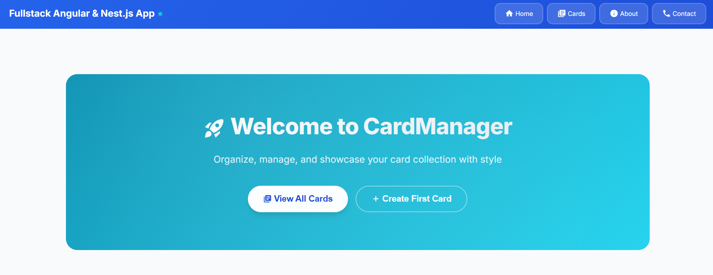
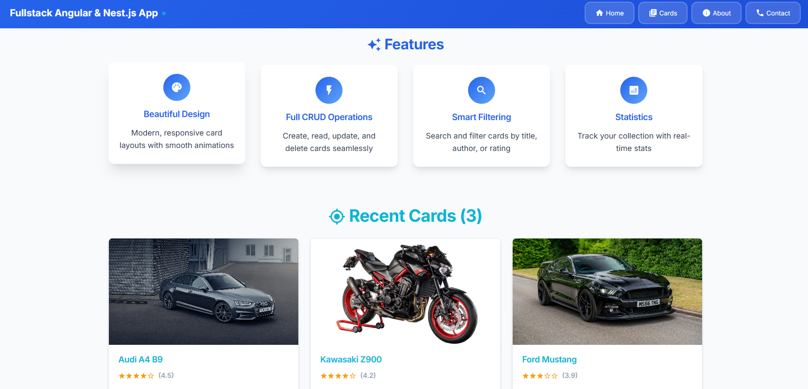
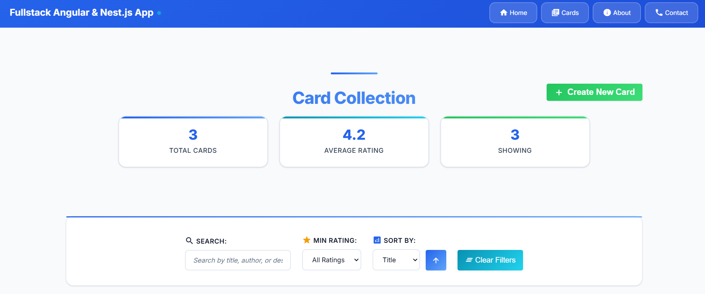
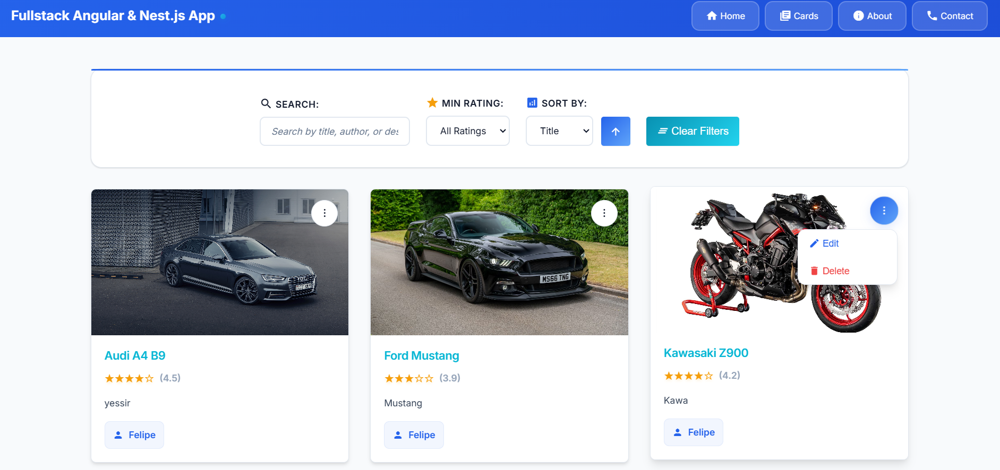
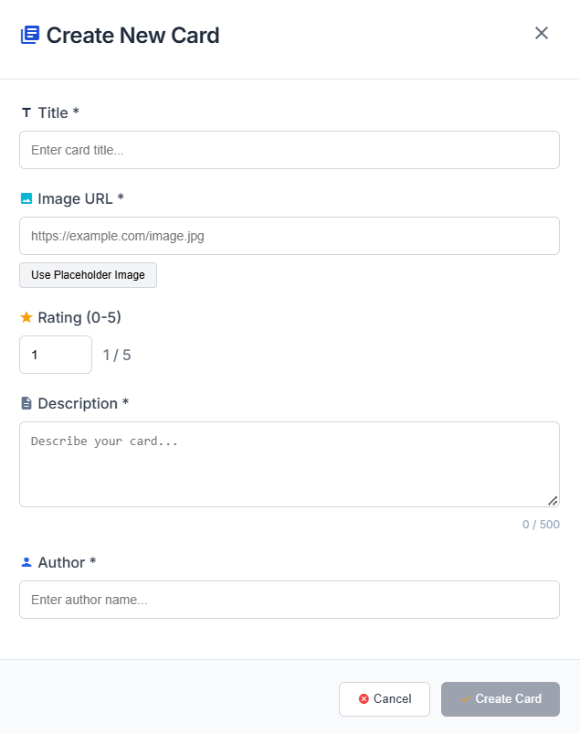
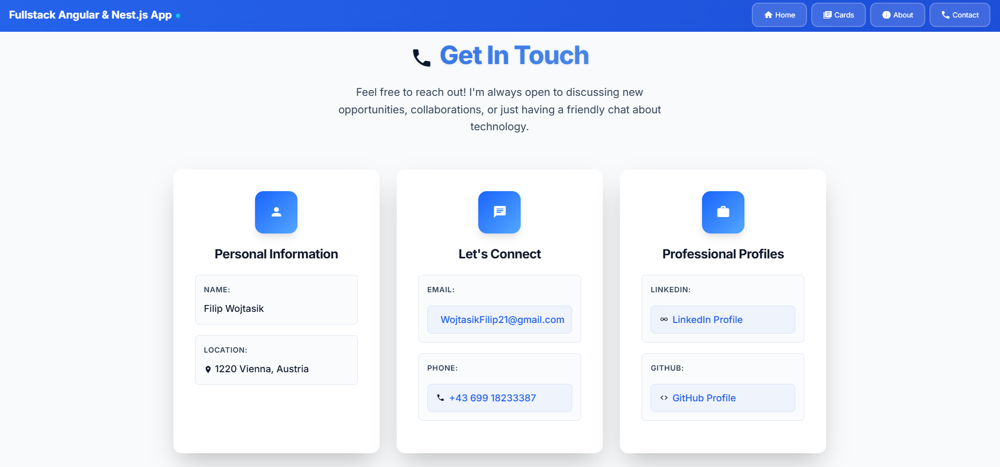

# Fullstack Angular App

A comprehensive fullstack example built with Angular 20.x (frontend with SSR) and NestJS (backend) demonstrating CRUD operations, advanced state management, and production-ready tooling.

## 📋 Overview

This application is a learning-focused, production-minded sample that showcases a complete CRUD workflow for "cards" with an Angular 20.x SPA frontend featuring SSR and zoneless change detection, and a NestJS REST API backend with comprehensive validation. It includes centralized styling tokens, responsive layouts, comprehensive NgRx state management, and modern development tooling.

> 🖼️ **Want a quick preview?** Check out the [Screenshots section](#-screenshots) below to see the application in action without needing to clone or install anything!

## 🛠️ Technical Stack

### Frontend

- **Angular 20.x** - Standalone components, SSR, Zoneless change detection
- **Angular Material** - Icons and UI primitives
- **NgRx** - Actions, effects, reducers, selectors, state for comprehensive state management
- **SCSS** - Centralized variables for consistent theming

### Backend

- **NestJS** - Modern Node.js framework with TypeScript
- **TypeORM** - Database access and entity management
- **PostgreSQL** - Data persistence with environment-based configuration

### Development Tools

- **ESLint & Prettier** - Code quality and formatting
- **Jest** - Testing framework
- **Proxy Configuration** - Development server setup

## 📁 Repository Structure

The repository follows a split frontend/backend structure:

```
fullstack-angular-app/
├── client/          # Angular application
│   ├── src/
│   │   ├── app/
│   │   │   ├── features/     # Reusable components
│   │   │   ├── pages/        # Page components
│   │   │   ├── services/     # Business logic services
│   │   │   ├── store/        # NgRx state management
│   │   │   └── models/       # TypeScript interfaces
│   │   ├── assets/           # Static assets
│   │   └── environments/     # Environment configurations
│   └── public/               # Public assets
│
└── server/          # NestJS API
    └── src/
        ├── controllers/      # API endpoints
        ├── services/         # Business logic
        └── models/          # DTOs and entities
```

## 🚀 Getting Started

### Prerequisites

- Node.js (v18+)
- PostgreSQL database
- npm or yarn

### Installation & Running

1. **Clone the repository**

   ```bash
   git clone <repository-url>
   cd fullstack-angular-app
   ```

2. **Frontend Setup**

   ```bash
   cd client
   npm install
   ng serve
   # or
   npm start
   ```

   The frontend will be available at `http://localhost:4200`

3. **Backend Setup**
   ```bash
   cd server
   npm install
   npm run start:dev
   ```
   The API will be available at `http://localhost:3000`

### Database Configuration

The backend requires a configured PostgreSQL database with environment variables. Check the `server/` directory for:

- `.env` file setup
- Database connection details
- Environment variable configuration

Refer to the server's README for specific database setup instructions.

## 🧪 Testing

### Frontend Tests

```bash
cd client
ng test
```

### Backend Tests

```bash
cd server
npm test
```

## 📚 Features

- **CRUD Operations** - Complete create, read, update, delete functionality for cards
- **State Management** - Centralized state with NgRx
- **Server-Side Rendering** - Angular Universal for improved SEO and performance
- **Responsive Design** - Mobile-first approach with SCSS variables
- **Type Safety** - Full TypeScript implementation across frontend and backend
- **Modern Architecture** - Standalone components and latest Angular features

## 🔧 Development

This project uses modern development practices:

- Zoneless change detection for better performance
- Comprehensive testing with Jasmine and Jest
- ESLint and Prettier for code quality
- Proxy configuration for seamless development experience

## 📖 Learning Resources

This project serves as an educational example demonstrating:

- Modern Angular architecture patterns
- NestJS backend development
- NgRx state management
- Full-stack TypeScript development
- Production-ready tooling and configuration

## 🖼 Screenshots

### Homepage

<details>
<summary><strong>🏠 Homepage</strong></summary>


_Homepage top section_


_Homepage features and recent cards_

</details>

### Cards

<details>
<summary><strong>🗂️ Cards List</strong></summary>




_List of cards with thumbnails and basic info_

</details>

</details>

### Create Card

<details>
<summary><strong>➕ Create Card</strong></summary>


_Form to create a new card_

</details>

### Contact

<details>
<summary><strong>✉️ Contact Page</strong></summary>


_Contact page_

</details>
